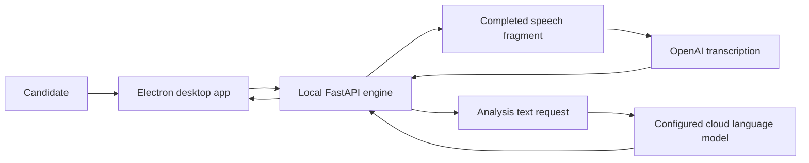

# SkillCue Public Architecture

This document describes product boundaries without exposing credentials, internal prompts, private endpoints, or security-sensitive implementation details.

## Data boundaries

- Completed speech fragments are sent to OpenAI directly or through the SkillCue gateway for transcription.
- Vacancies, resumes, and preparation history are stored locally by default.
- Only the minimum text required for the requested analysis is sent to the configured language-model provider.
- Website analytics, support, licensing, and payment services have separate data boundaries described in the public privacy notice.

## Components

### Electron desktop app

Provides vacancy preparation, spoken mock interviews, answer feedback, readiness views, and optional access to prepared notes.

### Local FastAPI engine

Coordinates local sessions, documents, speech processing, and minimal text requests. The packaged application protects its local interface; private details are intentionally omitted here.

### Cloud speech recognition

Transcribes completed speech fragments with OpenAI `gpt-4o-mini-transcribe` for the live path and `gpt-transcribe` for a completed mock-interview answer.

### Configured language-model provider

Receives only the text required for the selected feature, such as a vacancy excerpt, a question, or answer context. Model output is advisory and must be verified by the user.

## Responsible design

SkillCue is designed for preparation and articulation of real experience. It does not endorse fabricated qualifications, identity substitution, or violation of employer interview rules.
